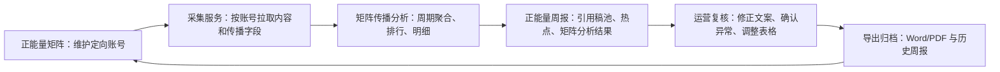
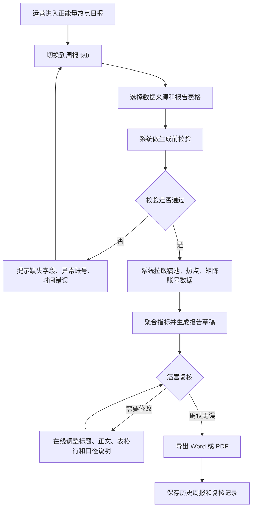

# 正能量态势感知平台优化项目 PRD

> 版本：v1.1  
> 日期：2026-06-18  
> 原型文件：`index.html`  
> 需求范围：在现有正能量态势感知平台基础上，新增「正能量矩阵」「矩阵传播分析」「正能量周报」三个模块，形成账号监测管理、传播分析、周报生成与复核归档闭环。

---

## 0. 产品评估与优化结论

从现有方案看，三个模块方向正确，但需要在评审前补齐以下关键问题，避免客户理解成“全网账号识别”或研发落地时口径漂移：

| 问题/机会 | 风险 | 优化结论 |
|---|---|---|
| 业务闭环表达不足 | 容易被看成三个独立菜单，难以说明新增价值 | 明确闭环为「矩阵账号台账 -> 周期内容采集 -> 传播效果分析 -> 周报草稿 -> 运营复核 -> 历史归档」 |
| 模块边界需更清晰 | 矩阵、分析、周报可能重复做筛选和明细 | 矩阵负责账号资产和采集状态，分析负责周期聚合和明细，周报负责选择周期、引用数据、生成文本、复核导出 |
| 原「正能量账号名单」口径不可实现 | 客户可能继续期待按话题热门参与情况自动列全量账号 | 正式替换为「正能量矩阵账号本周发布内容及传播效果」，仅覆盖客户确认并可定向采集的矩阵账号 |
| 数据缺失与异常处理不足 | 跨平台传播字段差异会影响统计可信度 | 明确传播量、互动量字段映射；平台无字段时标注「数据缺失」，不估算、不以互动量替代传播量 |
| 周报生成缺少复核机制 | 自动生成内容可能被视为最终报告，带来口径或措辞风险 | 周报只生成「草稿」，必须支持运营复核、表格行调整、异常提示确认后导出 |
| 前后端开发节点需要可验收 | 仅有页面描述，接口、状态、权限和交付物不足 | 按三个开发节点拆分前端、后端、数据口径、验收标准；每个节点同时交付 `PRD.md` 与 `index.html` 给前后端评审 |

---

## 1. 需求背景

现有正能量态势感知平台已具备正能量看板、稿件、热榜、热点日报等能力，但客户当前仍依赖运营人员手动整理《涉舟网络正能量数据简报》。人工报告存在三个核心问题：

- **统计链路分散**：稿池投稿、热点事件、账号传播表现分别依赖人工汇总，周期复用性弱。
- **账号名单口径不可落地**：原报告中的「正能量账号名单」来自话题热门参与情况，但平台无法稳定识别所有话题下的热门参与账号，且不同平台开放字段差异较大。
- **周报生成缺少产品化入口**：客户周报周期通常为「上周三到本周三」，样例中还存在精确到小时的统计口径，如 `6月3日20:00 至 6月10日16:00`，需要支持可配置时间范围和历史归档。

本次优化通过定向采集和管理正能量矩阵账号，分析矩阵账号在统计周期内发布的内容和传播效果，并将结果自动体现在周报草稿中，用可采集、可核验、可复用的口径替代不可实现的「话题热门参与账号名单」。

---

## 2. 建设目标

| 目标类型 | 描述 | 衡量指标 | 目标值 |
|---|---|---|---|
| 账号资产沉淀 | 建立正能量账号矩阵台账，支持账号新增、导入、筛选、状态管理 | 核心字段完整率 | >= 95% |
| 定向监测闭环 | 对纳入矩阵且接入采集的账号，按周期拉取内容与传播数据 | 可采集账号监测成功率 | >= 98% |
| 传播效果分析 | 对矩阵账号在周期内的发文、传播量、互动量、代表内容进行分析 | 周期分析生成成功率 | >= 98% |
| 周报自动化 | 按自定义时间范围自动生成周报草稿，并支持复核导出 | 单期报告制作耗时 | 从人工数小时降至 30 分钟内 |
| 口径可核验 | 用「矩阵账号本周内容及传播效果」替代不可落地账号名单 | 周报表格字段可追溯 | 100% 来自平台数据或人工复核记录 |

---

## 3. 总体产品方案

### 3.1 业务闭环



### 3.2 三个新增模块边界

| 模块 | 主要解决的问题 | 核心产物 | 不承担的范围 |
|---|---|---|---|
| 正能量矩阵 | 哪些账号纳入定向监测，账号是否可采集、是否纳入周报 | 账号台账、采集状态、周报纳入标记 | 不做周期传播趋势分析，不直接生成报告 |
| 矩阵传播分析 | 指定周期内矩阵账号发了什么、传播如何、哪些账号/主题贡献更高 | 指标、趋势、排行、账号传播效果明细 | 不维护账号基础信息，不编辑报告正文 |
| 正能量周报 | 将稿池、热点、矩阵账号分析结果形成报告草稿并导出 | 周报草稿、复核记录、Word/PDF、历史归档 | 不承诺全网话题参与账号识别 |

### 3.3 核心原则

- **先定向、后统计**：只有进入矩阵且具备可采集标识的账号，才进入自动分析与周报候选池。
- **先草稿、后确认**：系统生成的是可编辑周报草稿，不直接替代运营最终审核。
- **口径一致**：周报标题、正文、表格、导出文件和历史记录必须使用同一个统计周期和同一套数据过滤条件。
- **缺失透明**：平台无法提供传播量字段时标注「数据缺失」，不得用互动量、估算值或人工想象补齐。

---

## 4. 用户角色与权限

| 角色 | 核心诉求 | 权限范围 |
|---|---|---|
| 运营人员 | 维护账号名单，查看传播表现，生成并复核周报草稿 | 新增/编辑账号、导入账号、查看分析、生成/编辑/导出周报 |
| 主管人员 | 快速了解本周正能量传播情况和重点账号表现 | 查看分析结果、预览/下载已完成周报 |
| 系统管理员 | 管理采集状态、字段字典、权限配置和异常处理 | 全量账号管理、采集配置、组织权限、异常重试 |
| 数据/后端人员 | 提供账号、内容、传播、报告生成接口 | 数据接入、聚合计算、模板渲染、导出服务 |

权限要求：

- 非运营/管理员角色不可新增、删除、导入账号，不可生成或覆盖周报。
- 周报导出前必须记录最后编辑人、编辑时间、统计周期、数据来源和口径版本。
- 账号「移出矩阵」只影响后续统计，不删除历史内容和历史报告中的引用记录。

---

## 5. 核心用户旅程

### 5.1 首次初始化账号矩阵

1. 运营人员导入或新增正能量账号。
2. 系统按「平台 + 平台账号 ID」判重；缺少平台账号 ID 时，按「平台 + 账号主页链接」判重。
3. 导入后的账号默认为「待核验」。
4. 管理员或采集服务补齐平台账号 ID，并将采集情况更新为「采集中 / 未接入 / 异常」。
5. 运营确认账号属地、账号类型、内容定位和「是否纳入周报」。

### 5.2 每周传播分析

1. 运营进入「矩阵传播分析」，选择统计周期，默认使用上周三到本周三。
2. 系统仅统计「采集中」且「运行情况正常」的矩阵账号。
3. 系统聚合周期内账号发布内容、传播量、互动量、代表内容、热点贡献。
4. 运营查看趋势、排行、属地/主题分布和账号明细。
5. 明细可推送至周报表 3 的候选数据。

### 5.3 周报生成与复核

1. 运营进入「正能量周报」，选择统计周期和数据来源。
2. 系统进行生成前校验：时间范围、数据源、表格配置、异常账号、缺失字段。
3. 系统生成周报草稿，自动填充总体情况、工作情况、稿池表、热点事件表、矩阵账号传播效果表。
4. 运营复核正文措辞、表格行、异常提示和口径说明。
5. 运营确认后导出 Word/PDF，系统保存历史周报和生成记录。

---

## 6. 功能范围

### 6.1 导航与报告入口

在现有平台顶部导航新增两个一级入口：

- 正能量矩阵
- 矩阵传播分析

周报能力不作为新的顶部一级菜单展示，沿用现有「正能量热点日报」报告模块，在报告类型切换中新增「周报」tab，与原「日报」并列。

导航风格沿用现有平台：白底顶部栏、蓝色激活态、内容区浅灰底和白色面板。

### 6.2 正能量矩阵

用于定向管理正能量账号，账号一经接入后可作为分析和周报的数据来源。

#### 6.2.1 账号运行情况统计

页面顶部展示账号运行情况统计，复用新媒体矩阵管理系统的统计结构：

- 运营范围切换：全部、自主运营、代运营。
- 状态统计：正常运行账号、停更账号、待注销账号、已注销/关停账号。
- 状态变化：停更、注销、关停等字段展示较上月变化值。
- 内容定位统计：采编账号、经营账号、内部信息发布账号。

#### 6.2.2 账号列表字段

| 字段 | 说明 | 是否必填 | 备注 |
|---|---|---|---|
| 账号名称 | 平台展示账号名 | 是 | 支持模糊搜索 |
| 平台 | 微博、抖音、微信公众号、视频号、新闻客户端等 | 是 | 字典可配置 |
| 账号主页链接 | 用于采集定位和人工核验 | 是 | 导入时用于辅助判重 |
| 平台账号 ID | 后端采集使用的唯一账号标识 | 接入后必填 | 采集中账号必须有 |
| 属地 | 舟山、定海、普陀、岱山、嵊泗等 | 是 | 支持后续拓展 |
| 账号类型 | 官方媒体、政务账号、自媒体账号、传播达人 | 是 | 字典可配置 |
| 内容定位 | 城市形象、民生服务、海岛文旅、基层治理、产业发展等 | 是 | 可多选时后端需扩展关系表 |
| 运行情况 | 正常、停更、待核验、失效 | 是 | 影响是否进入统计 |
| 采集情况 | 采集中、未接入、异常 | 是 | 来源于采集服务或管理员操作 |
| 运维负责人 | 账号联系人或系统维护人 | 否 | 用于异常流转 |
| 是否纳入周报 | 控制账号是否进入周报候选池 | 是 | 默认为否，运营确认后启用 |

#### 6.2.3 矩阵列表与筛选

列表区域采用「新媒体矩阵 / 状态变更审核」tab 结构，默认进入「新媒体矩阵」。

筛选项：

- 所属部门
- 媒体类型
- 运行情况
- 所属圈层
- 采集情况
- 属性
- 是否认证
- 内容定位
- 自主情况
- 变更记录
- 是否已读
- 关键词搜索

列表字段需覆盖账号名称、媒体类型、子类型、所属部门、属性、是否认证、内容定位、运行情况、自主情况、运维负责人、联系方式、粉丝数、采集情况、上次发稿时间、最新操作时间和操作入口。

#### 6.2.4 账号操作

- 新增账号：填写账号名称、平台、主页链接、属地、账号类型、内容定位、负责人。
- 批量导入：支持 Excel 导入，导入后进入「待核验」状态，并返回成功、重复、失败明细。
- 编辑账号：允许调整属地、类型、定位、负责人、运行情况、是否纳入周报。
- 启用/停用采集：对接采集服务，更新采集状态。
- 移出矩阵：仅从矩阵管理中移除，不删除历史内容数据。
- 异常处理：采集异常账号进入异常清单，提示负责人、异常原因、最近成功采集时间。

周报可用建议规则：

- 「重点展示」：纳入周报、采集中、周期内有发文，且传播量或互动量进入矩阵账号前 20%。
- 「常规展示」：纳入周报、采集中、周期内有发文，但未进入重点展示。
- 「不展示」：未纳入周报、未接入采集、采集异常、周期内无发文，或传播关键字段缺失且未人工确认。

### 6.3 矩阵传播分析

用于分析定向矩阵账号在指定周期内的内容发布与传播效果。

#### 6.3.1 筛选条件

- 时间范围：提供「昨日、近7天、近30天、全年」快捷项，支持自定义起止日期。
- 平台切换：微信、微博、抖音、视频号、其他。
- 账号检索：支持按账号名称搜索账号传播详情。
- 稿件检索：支持按稿件标题搜索稿件传播明细。
- 账号筛选：稿件传播明细支持按账号筛选，默认「全部」。
- 数据导出：账号传播详情和稿件传播明细均提供导出入口。

#### 6.3.2 核心指标

| 指标 | 说明 |
|---|---|
| 发稿数 | 周期内矩阵账号发布内容总数 |
| 总互动量 | 点赞、评论、转发、在看等互动字段映射汇总 |
| 点赞数 | 周期内矩阵账号内容点赞量汇总 |
| 评论数 | 周期内矩阵账号内容评论量汇总 |
| 转发数 | 周期内矩阵账号内容转发量汇总 |

#### 6.3.3 分析视图

- 传播力总览：以 5 个指标卡展示发稿数、总互动量、点赞数、评论数、转发数。
- 传播力变化趋势：按日期展示全部平台及各平台传播力变化折线，支持通过平台标签识别微信、微博、抖音、视频号、其他。
- 账号传播详情：按平台展示账号名称、所属平台、发稿数、点赞数、阅读数、转发数、在看数、总互动量。
- 稿件传播明细：按平台和账号展示稿件标题、所属账号、所属平台、发布日期、点赞数、阅读数、转发数、在看数、总互动量。
- 周报引用关系：账号传播详情和稿件传播明细作为周报「矩阵账号本周内容及传播效果」的数据来源之一。

### 6.4 正能量热点日报 / 周报

#### 6.4.1 报告入口

报告模块先复刻现有线上形态，再在报告类型中增加「周报」tab。首屏以报告列表为主，不默认展示周报生成设置、正文预览或复核步骤。

展示规则：

- 一级 tab：自动报告、人工报告。
- 二级类型：日报、周报。
- 筛选区：发布时间起止日期、关键词搜索。
- 列表区：以报告卡片展示报告名称、统计日期或统计周期。
- 卡片操作：鼠标悬停在报告卡片时展示「预览」按钮，按钮不常驻占用列表空间。
- 分页区：展示总数、页码和翻页控件。
- 周报生成设置页：从周报卡片进入，展示统计周期、候选数据挑选和下载按钮。
- 预览弹窗：用于快速查看报告内容，不替代详情页编辑能力。

交互规则：

- 点击「日报」展示正能量热点日报卡片。
- 点击「周报」展示正能量周报卡片。
- 点击「自动报告 / 人工报告」切换对应报告来源。
- 点击周报卡片进入周报生成设置页。
- 点击日报卡片默认打开日报预览。
- 鼠标悬停报告卡片时展示「预览」按钮，点击后打开报告预览弹窗；该按钮需阻止卡片点击事件，不能同时进入设置页。
- 周报生成设置页提供「返回」「预览」「下载」动作。
- 点击弹窗关闭按钮、遮罩或按 Esc 关闭预览弹窗。

数据规则：

- 取数规则：日报沿用现有正能量热点日报记录；周报取已生成或已人工维护的正能量周报记录。
- 数据筛选规则：按报告来源、报告类型、发布时间范围和关键词取交集筛选。
- 数据排序规则：默认按报告发布时间倒序展示。

#### 6.4.2 周报生成设置页

展示规则：

- 顶部展示返回按钮、页面标题、当前统计周期、预览按钮和下载按钮。
- 左侧仅展示统计周期和生成状态提示，不再展示数据来源、报告表格等额外配置项。
- 右侧展示当前统计周期下与最终报告强相关的候选数据，包括稿池投稿、正面热点事件、矩阵账号传播效果。
- 候选数据以可挑选列表展示，每条数据支持保留、移除和恢复。

交互规则：

- 点击「返回」回到报告列表，并保留原报告类型 tab 状态。
- 修改统计周期后，页面状态提示同步展示当前周期。
- 点击候选数据类型 tab，可在稿池投稿、热点事件、矩阵账号之间切换。
- 点击候选数据的「移除」后，该数据不再进入最终报告正文、表格和预览；点击「恢复」可重新纳入。
- 点击「恢复全部」后，当前统计周期下所有候选数据重新纳入报告。
- 点击「预览」打开周报预览弹窗，预览内容需以报告正文版式展示总体情况、情绪分布图、工作情况、稿池投稿表、热点事件表和矩阵账号传播表。
- 点击「下载」后，系统只使用保留下来的候选数据下载当前配置数据；若候选数据全部被移除，禁止下载并提示至少保留 1 条数据。

数据规则：

- 取数规则：周报生成设置页引用当前周报卡片对应的统计周期，并取稿池投稿、正面热点事件和矩阵账号传播效果三类数据。
- 数据筛选规则：按照统计周期以及运营保留/移除状态取交集。
- 数据排序规则：候选数据按稿池投稿、热点事件、矩阵账号的业务顺序分组展示；组内默认按报告展示优先级、传播量、互动量或篇次降序排序。
- 数据引用规则：最终周报正文、表格和预览只引用处于保留状态的候选数据，被移除数据保留在当前操作态中用于恢复，不写入最终报告。
- 下载规则：下载文件必须包含当前统计周期、已保留的稿池投稿、热点事件、矩阵账号传播效果和摘要统计；被移除数据不进入下载文件。
- 预览规则：报告预览中的摘要指标、正文描述和三张表格必须由已选候选数据实时生成；移除任一候选数据后，预览中的对应行和统计值同步减少。

#### 6.4.3 时间范围

客户周报周期通常为「上周三到本周三」。系统提供默认快捷项，同时允许运营手动调整具体小时。

建议规则：

- 默认快捷项：上周三 `00:00:00` 至本周三 `23:59:59`。
- 可配置为客户实际运营口径：上周三 `20:00:00` 至本周三 `16:00:00`。
- 报告标题、正文统计周期、接口查询参数、导出文件和历史周报记录必须使用同一时间范围。
- 历史周报保存生成时的起止时间，不随默认规则变更而变化。

#### 6.4.4 周报结构

参考运营手动报告，自动生成如下结构：

1. 标题：涉舟网络正能量数据简报
2. 一、总体情况
   - 涉舟信息总量
   - 正向情绪占比
   - 矩阵账号发布内容数
   - 正面热点事件数
   - 热点传播量
3. 图 1：涉舟信息情绪分布图
4. 二、工作情况
   - 稿池投稿整体描述
   - 热点事件整体描述
   - 矩阵账号传播表现整体描述
5. 表 1：正能量稿池投稿情况
6. 表 2：正面报道热点事件
7. 表 3：矩阵账号本周内容及传播效果

#### 6.4.5 关键口径替换

原手动报告中的表 3 为「正能量账号名单」，其隐含口径是从话题热门参与情况中识别账号。由于平台无法稳定识别所有话题参与账号，且不同平台对参与账号、互动账号、阅读来源等字段开放程度不一致，该口径不进入本次系统建设范围，也不在对外交付中承诺。

**替代方案：**

将表 3 调整为「正能量矩阵账号本周发布内容及传播效果」。该表只统计客户确认纳入矩阵、具备定向采集条件、且在统计周期内产生可核验内容数据的账号。

**客户可接受表达建议：**

> 为保证周报数据可采集、可核验、可复用，系统不采用“按话题自动识别全部热门参与账号”的不稳定口径，调整为展示已纳入正能量矩阵的重点账号在本统计周期内的发布内容及传播效果。该口径能够反映客户重点管理账号的运营表现，并可与账号台账、传播分析、周报导出数据逐项追溯。

建议字段：

| 字段 | 说明 |
|---|---|
| 属地 | 账号所属属地 |
| 账号名称 | 定向矩阵账号 |
| 平台 | 内容发布平台 |
| 发文数 | 周期内发布正能量内容数 |
| 传播量 | 周期内内容传播量合计，缺失时展示「数据缺失」 |
| 互动量 | 周期内互动量合计，缺失时展示「数据缺失」 |
| 代表内容 | 周期内传播量或互动量最高的代表内容 |
| 数据状态 | 数据完整、传播量缺失、互动量缺失、采集异常 |
| 周报建议 | 重点展示、常规展示、不展示 |

#### 6.4.6 生成流程



#### 6.4.7 生成策略

- 报告正文采用模板化生成，避免完全自由生成导致措辞失控。
- 总体情况优先引用平台已有看板、情绪分布、热点事件和矩阵分析结果。
- 矩阵账号表默认按「周报建议、传播量、互动量、发文数」排序。
- 若传播量缺失但互动量完整，该账号仍可展示互动量，但传播量字段必须展示「数据缺失」。
- 若表 3 无可用账号，报告中保留表头和空状态说明：「本周期内暂无符合采集条件的矩阵账号传播数据」。
- 运营修改正文或删除表格行时，系统记录人工修订痕迹，历史报告保留最终导出版本。

#### 6.4.8 报告状态

| 状态 | 说明 | 可用操作 |
|---|---|---|
| 待生成 | 尚未生成草稿 | 选择周期、选择数据源、生成草稿 |
| 生成中 | 数据拉取或正文生成中 | 取消、查看进度 |
| 待复核 | 草稿已生成，等待运营确认 | 编辑、预览、重新生成、确认 |
| 已完成 | 运营确认并导出 | 预览、下载、复制生成 |
| 生成失败 | 数据、模板或导出异常 | 查看原因、重新生成 |

---

## 7. 数据口径

### 7.1 统计周期口径

- 统计周期以运营在周报生成页选择的起止时间为准。
- 分析页和周报页应共用同一套时间参数格式：`YYYY-MM-DD HH:mm:ss`。
- 起止时间采用闭区间或半开区间需由后端统一，建议使用 `[startTime, endTime)`，避免边界重复统计。
- 页面展示可按自然日期聚合，但底层查询仍使用精确到秒的起止时间。

### 7.2 账号纳入口径

进入矩阵传播分析的账号需满足：

- 未被移出矩阵。
- 运行情况为「正常」。
- 采集情况为「采集中」。
- 具备平台账号 ID 或后端可识别的唯一采集标识。

进入周报表 3 的账号还需满足：

- 「是否纳入周报」为是。
- 周期内至少有 1 条符合正能量内容规则的发布内容。
- 至少具备发文数和代表内容，传播量或互动量缺失时需要展示缺失状态。

### 7.3 内容纳入口径

正能量矩阵账号发布内容进入统计需满足：

- 发布时间落在统计周期内。
- 内容所属账号在统计周期内为有效矩阵账号。
- 内容命中正能量标签、正面情绪、稿池引用、热点事件关联或人工标记中的至少一种。
- 删除、下架、采集失败且无法核验的内容不进入统计。

### 7.4 传播量与互动量字段映射

| 平台 | 传播量字段建议 | 互动字段建议 | 备注 |
|---|---|---|---|
| 微博 | 阅读量、视频播放量 | 转发、评论、点赞 | 话题阅读量只用于话题分析，不作为单账号内容传播量 |
| 抖音 | 播放量 | 点赞、评论、分享、收藏 | 同一视频多次采集取周期内最新可用值 |
| 微信公众号 | 阅读量、看一看、在看 | 点赞、分享、留言 | 若阅读量不可取，展示数据缺失 |
| 视频号 | 播放量 | 点赞、评论、转发、收藏 | 以内容维度可取字段为准 |
| 新闻客户端 | 浏览量、阅读量 | 评论、点赞、分享 | 不同客户端字段需做来源标识 |

规则：

- 如平台无传播量字段，应标记为「数据缺失」，不得用互动量或估算值替代。
- 传播量、互动量默认按内容维度汇总；同一内容跨平台发布时按平台内容分别统计。
- 对存在重复采集的内容，以平台内容 ID 去重；无内容 ID 时按「账号 ID + 标题 + 发布时间」辅助判重。

---

## 8. 数据模型建议

### 8.1 矩阵账号

```json
{
  "accountId": "string",
  "accountName": "新舟山",
  "platform": "news_app",
  "platformAccountId": "string",
  "homepageUrl": "https://example.com/account",
  "region": "舟山",
  "accountType": "official_media",
  "contentPosition": "城市形象",
  "runningStatus": "normal",
  "collectionStatus": "collecting",
  "ownerName": "王老师",
  "ownerPhone": "string",
  "includedInWeeklyReport": true,
  "removedFromMatrix": false,
  "lastCollectedAt": "2026-06-10 15:50:00",
  "createdAt": "2026-06-18 10:00:00",
  "updatedAt": "2026-06-18 10:00:00"
}
```

### 8.2 账号周期统计

```json
{
  "accountId": "string",
  "statStartTime": "2026-06-03 20:00:00",
  "statEndTime": "2026-06-10 16:00:00",
  "postCount": 14,
  "reachTotal": 23771000,
  "interactionTotal": 316000,
  "hotContentCount": 2,
  "dataStatus": "complete",
  "weeklySuggestion": "highlight",
  "topContent": {
    "contentId": "string",
    "title": "舟山学子高考前夕为班主任打造专属惊喜",
    "publishTime": "2026-06-06 09:30:00",
    "reach": 23771000,
    "interaction": 316000
  }
}
```

### 8.3 周报记录

周报记录用于支撑报告列表、详情预览、导出和历史追溯。

- 展示规则：列表卡片展示报告名称、报告类型、统计周期、生成方式和最近更新时间。
- 交互规则：点击卡片进入报告详情；详情页提供预览、编辑、导出和复核动作。
- 数据规则：
  - 取数规则：取已生成、已人工维护或已复核归档的报告记录。
  - 数据筛选规则：支持按自动报告/人工报告、日报/周报、发布时间范围和关键词筛选。
  - 数据排序规则：默认按最近更新时间倒序，状态相同情况下按统计周期结束时间倒序。

---

## 9. 数据协作边界

### 9.1 账号台账数据

- 取数规则：来自客户确认纳入正能量矩阵的定向账号台账。
- 数据筛选规则：支持属地、平台、账号类型、内容定位、运行情况、采集情况、是否纳入周报和关键词筛选，多条件取交集。
- 数据排序规则：默认按采集情况、运行情况、最近更新时间排序，异常账号优先展示。

### 9.2 矩阵传播数据

- 取数规则：来自纳入矩阵且具备采集条件的账号在统计周期内发布的内容及传播字段。
- 数据筛选规则：支持时间范围、属地、平台、账号类型、内容主题、数据状态和关键词筛选，多条件取交集。
- 数据排序规则：指标卡按统计周期汇总；排行默认按传播量降序；明细默认按传播量、互动量、发文数降序。

### 9.3 报告数据

- 取数规则：日报沿用现有正能量热点日报数据；周报引用稿池投稿、正面热点事件和矩阵账号传播效果。
- 数据筛选规则：报告列表支持自动报告/人工报告、日报/周报、发布时间范围和关键词筛选。
- 数据排序规则：报告列表默认按发布时间倒序；周报详情内表格默认按业务口径排序。

---

## 10. 前后端开发节点

> 交付开发节点时，`PRD.md` 和 `index.html` 均作为前后端共同评审材料，不拆分只给单方。

### 节点 1：矩阵账号台账

- 前端：账号列表、筛选、新增/编辑弹窗、批量导入入口、账号分析卡、异常状态展示。
- 后端：账号 CRUD、字典接口、导入校验、判重逻辑、采集状态同步字段。
- 数据：明确平台账号 ID、主页链接、属地、账号类型、内容定位、运行情况、采集情况、是否纳入周报字段。
- 验收：账号可新增、导入、编辑、筛选；异常账号有状态提示；移出矩阵不删除历史内容。
- 交付物：`PRD.md` + `index.html` 对齐页面字段和交互。

### 节点 2：矩阵传播分析

- 前端：周期筛选、核心指标、趋势图、排行、属地/主题分布、账号效果明细、数据可用性提示。
- 后端：按账号、内容、平台、属地、主题聚合传播量和互动量，输出缺失字段状态。
- 数据：统一传播量、互动量、代表内容、热点贡献、异常账号口径。
- 验收：自定义周期可查询；指标、排行、明细口径一致；字段缺失时展示缺失状态而非估算。
- 交付物：`PRD.md` + `index.html` 对齐分析口径和数据字段。

### 节点 3：报告模块周报增强

- 前端：复刻现有报告列表，新增日报/周报类型切换；周报详情页承载预览、编辑、导出入口和复核动作。
- 后端：报告数据聚合、模板渲染、草稿保存、复核记录、Word/PDF 导出。
- 数据：统一统计周期、数据来源、表格字段、口径版本、人工修订记录。
- 验收：生成前能提示异常；草稿可编辑；导出文件与预览口径一致；历史周报保留生成时周期和版本。
- 交付物：`PRD.md` + `index.html` 对齐报告结构和替代表格。

---

## 11. 异常与边界

| 场景 | 产品处理 |
|---|---|
| 账号采集异常 | 列表展示异常状态，分析页不纳入有效统计，周报生成前提示异常账号数量和名单入口 |
| 平台字段缺失 | 缺失传播量或互动量时显示为「数据缺失」，不做估算 |
| 周报生成失败 | 展示失败原因，支持重新生成；已生成草稿不被失败任务覆盖 |
| 时间范围为空 | 禁止生成周报，提示补全起止时间 |
| 结束时间早于开始时间 | 前端拦截，后端二次校验 |
| 无矩阵账号数据 | 周报表 3 展示空状态和说明，不输出虚假账号 |
| 账号重复导入 | 按平台 + 平台账号 ID 判重；缺失 ID 时按平台 + 主页链接判重 |
| 权限不足 | 非运营/管理员角色仅可查看，不可新增账号或生成报告 |
| 口径变更 | 新报告使用新口径版本，历史报告保留原口径版本和导出文件 |

---

## 12. 验收标准

### 12.1 全局验收

- 顶部导航可进入正能量矩阵、矩阵传播分析，以及现有正能量热点日报报告模块。
- `#matrix`、`#analysis`、`#weekly` 路由可用，其中 `#weekly` 对应现有报告模块增强页。
- 两个新增入口和一个报告增强页能串起账号管理、传播分析、周报生成、复核导出闭环。
- 系统不再承诺按话题热门参与情况生成「正能量账号名单」。
- 页面和导出报告均展示可接受的口径替代表达。

### 12.2 正能量矩阵

- 支持按属地、平台、账号类型、内容定位、运行情况、采集情况筛选。
- 账号列表能展示本周发文、传播量、采集状态、是否纳入周报。
- 新增/导入账号后能进入待核验或采集状态流转。
- 账号分析卡能展示周期表现、代表内容和周报可用建议。

### 12.3 矩阵传播分析

- 支持自定义周期展示发布内容、传播量、互动量、活跃账号、热点贡献。
- 趋势、排行、属地/主题分布和明细使用同一统计周期。
- 账号传播效果明细可作为周报表 3 数据来源。
- 数据缺失、采集异常账号有明确提示，不参与虚假汇总。

### 12.4 正能量热点日报 / 周报

- 报告模块保留现有「自动报告 / 人工报告」结构。
- 报告模块新增「日报 / 周报」类型切换，周报不作为新的顶部一级菜单。
- 周报列表卡片能展示报告名称、统计周期和报告来源。
- 报告卡片 hover 时展示「预览」按钮，点击只打开预览弹窗，不触发进入设置页。
- 点击周报卡片主体进入周报生成设置页，可返回报告列表。
- 周报生成设置页能展示统计周期、数据来源、报告表格、候选数据挑选和已选计数。
- 周报生成设置页能展示当前统计周期下的候选数据，支持按稿池投稿、热点事件、矩阵账号切换查看。
- 运营可移除或恢复候选数据，预览和最终报告只引用保留下来的数据。
- 报告预览尽量完整展示草稿内容，至少包含稿池投稿情况、涉舟正面报道热点事件、矩阵账号本周内容及传播效果三张表。
- 支持默认「上周三到本周三」和自定义小时级起止时间。
- 周报详情或生成页再承载时间范围、数据来源、表格配置、异常账号和缺失字段校验。
- 周报详情预览包含总体情况、工作情况、稿池投稿表、热点事件表、矩阵账号内容及传播效果表。
- 导出的 Word/PDF 周报中的统计周期、正文描述和表格数据口径一致。
- 历史周报保存状态、统计周期、生成方式、导出文件和复核记录。

---

## 13. 原型说明

- 原型路径：`positive-energy-situation-optimization/index.html`
- 主要页面：
  - `#matrix`：正能量矩阵
  - `#analysis`：矩阵传播分析
  - `#weekly`：正能量热点日报模块，内含日报 / 周报切换
- 原型使用样例数据展示页面结构和口径，不代表最终线上数据。
